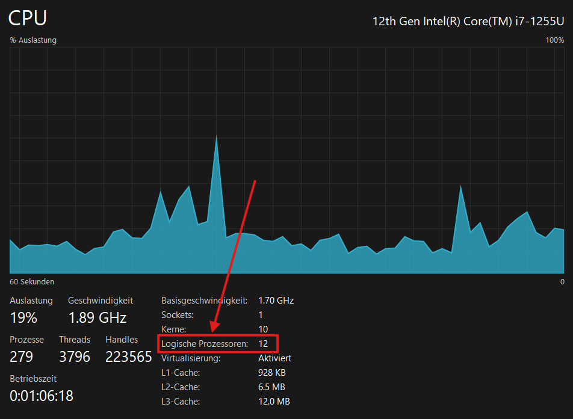
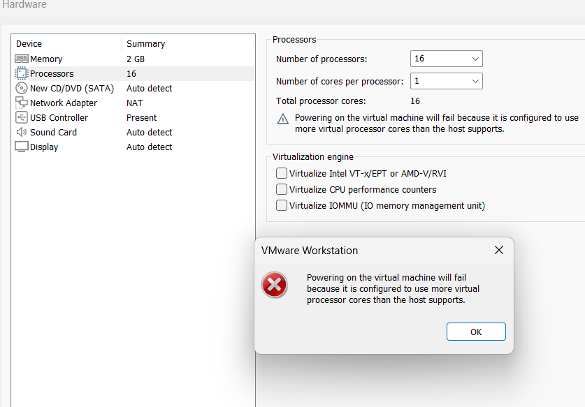
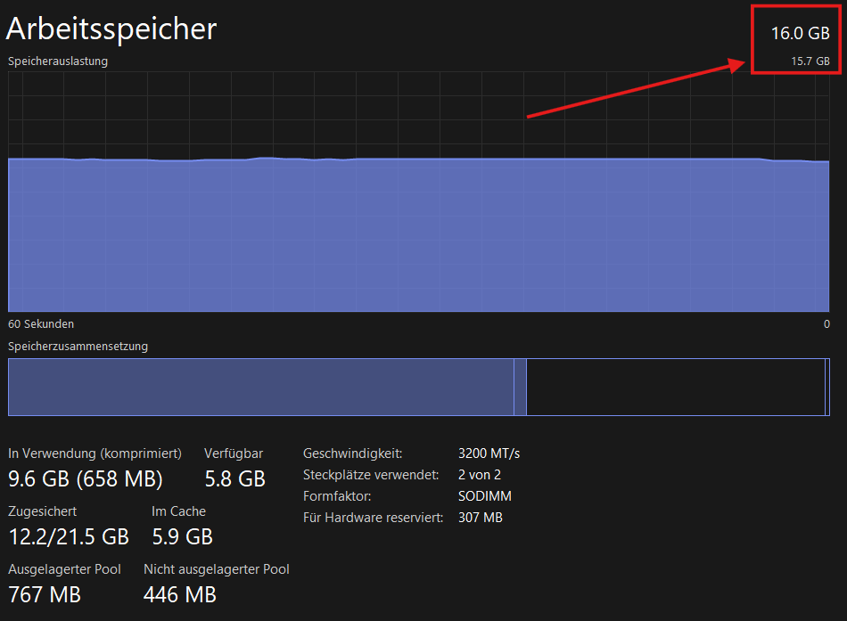

# KN01

## Aufgabe A

Ein **Hypervisor** erlaubt das gleichzeitige Ausführen mehrerer virtueller Maschinen auf einer physischen Hardware.
- **Typ-1-Hypervisor**: Läuft direkt auf der Hardware und bietet höhere Leistung.
- **Typ-2-Hypervisor**: Läuft auf einem Betriebssystem, ist einfacher zu verwenden, aber weniger effizient.
**Unterschied**: Typ-1-Hypervisor läuft direkt auf der Hardware; Typ-2 basiert auf einem Betriebssystem.

## Aufgabe B

### Vermutung Hypervisor meines Systems
Ich glaube, dass ich einen Hypervisor Typ 2 benutze. Ich nehmen das an, weil ich Windows habe und die WM-Ware Software installiert habe.

### CPU Prozessoren

### Fehlermeldung

### RAM

### Nicht RAM

### Erklärungen zu Fehlermeldungen
Die Fehlermeldungen erscheinen, weil es ist nicht möglich ist mehr Leistung zu beanspruchen als ich überhaupt habe.