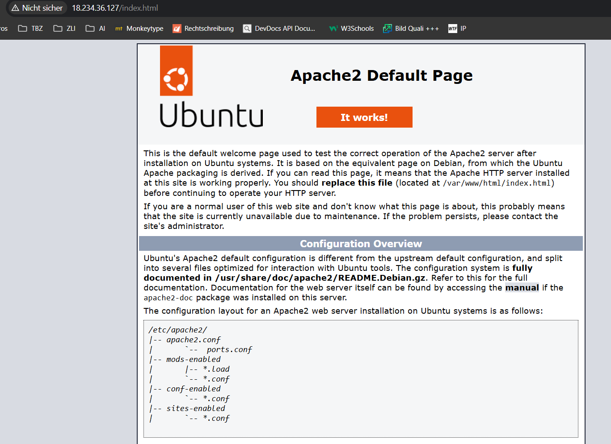
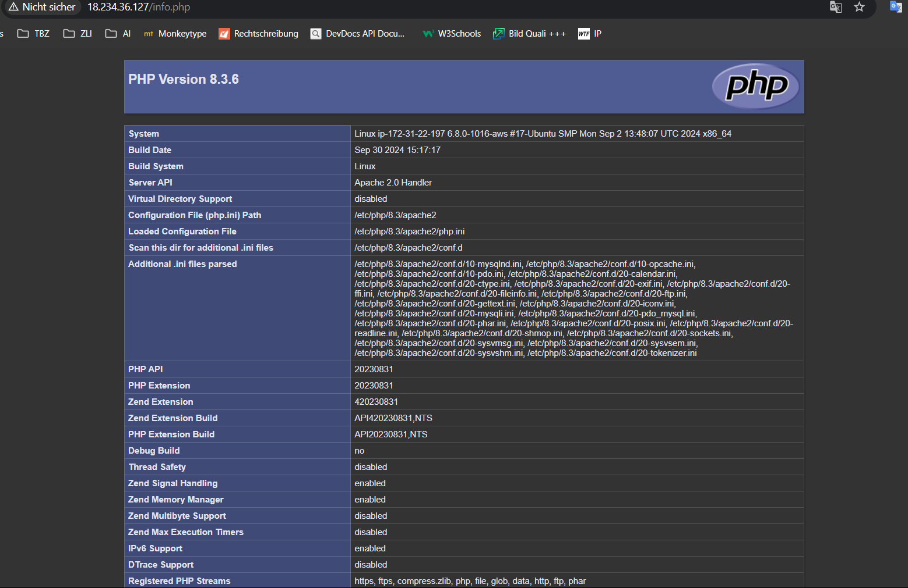
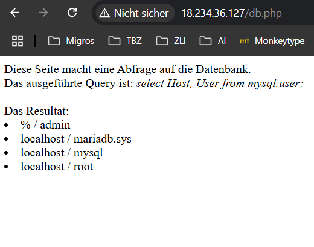
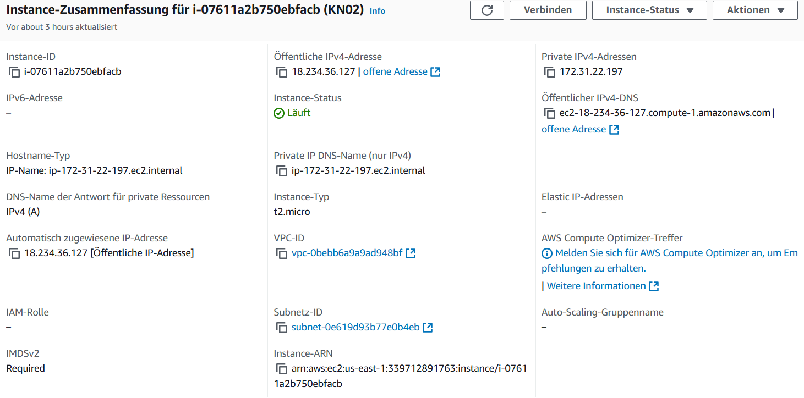
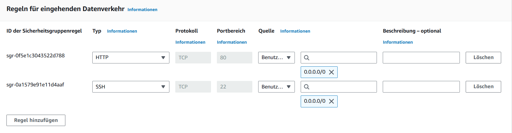
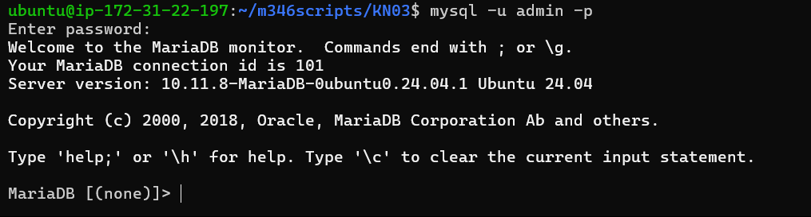

# KN01

### index.html

### info.php

### db.php

### Details der Instanz

### Sicherheitsgruppen

### MySQL Login

### Was liest die Ausgabe aus?

\Die Abfrage fragt den Host und den User aus der Tabelle mysql.user aus.