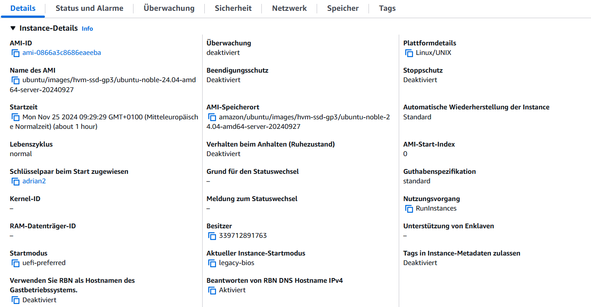
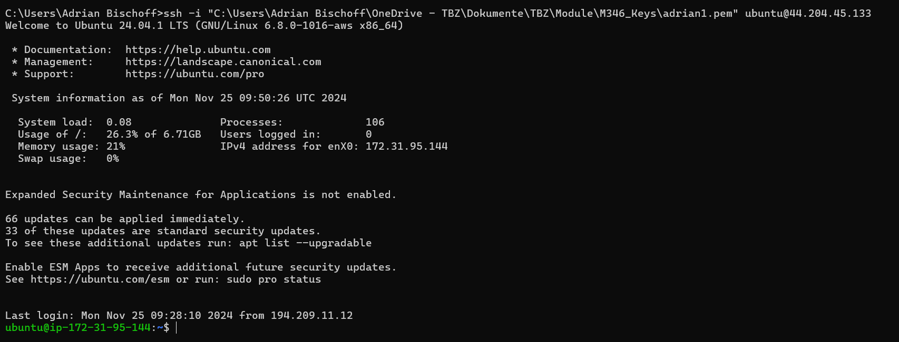
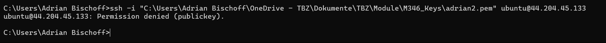
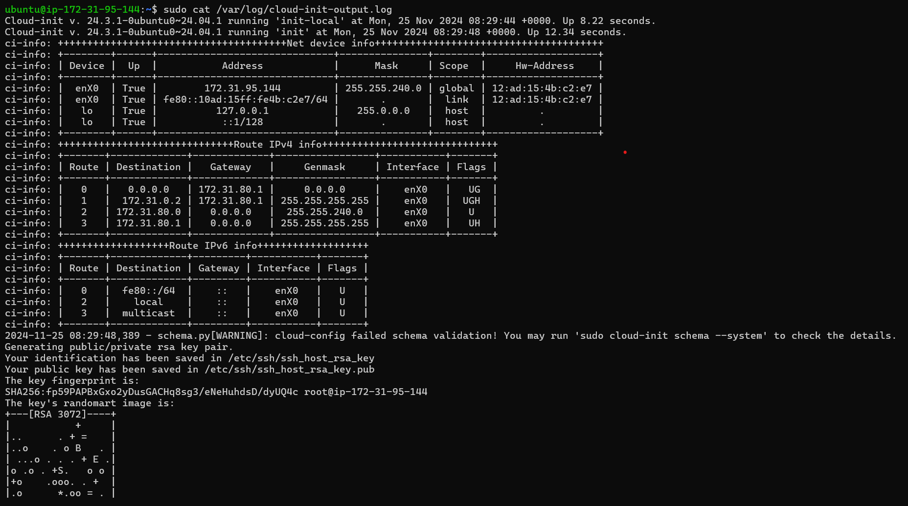
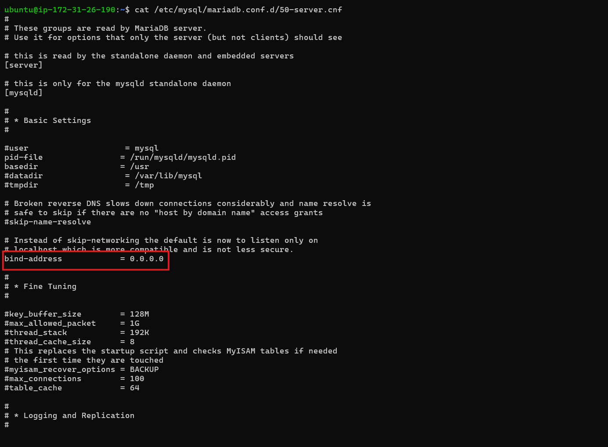
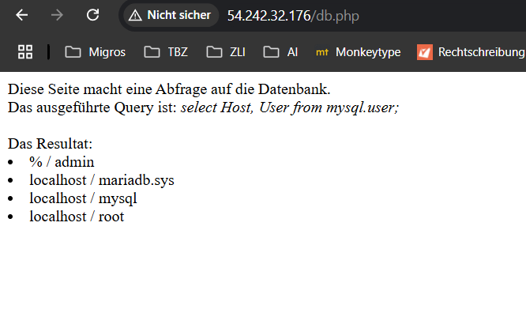
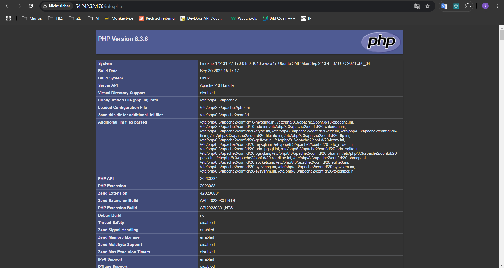
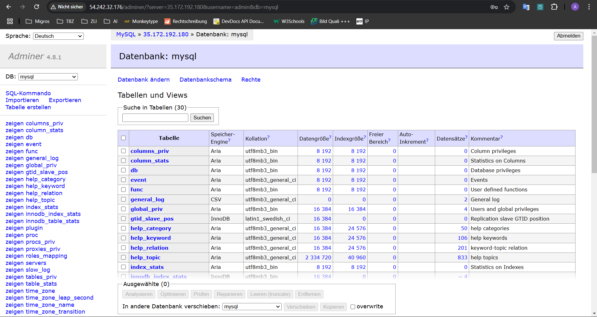

# KN04

## Aufgabe A

### Cloud-Init-Datei
[cloud-init.yaml](/m346/KN04/cloud-init.yaml)

## Aufgabe B

### Details der Instanz

### Verwendung des ersten Keys

### Verwendung des zweiten Keys

### Cloud-Init-Log

### Cloud-Init-Datei
[cloud-init.yaml](/m346/KN04/cloud-init.yaml)

## Aufgabe C

### Template Cloud-Init-Datei
[Cloud-Init-Datei](/m346/KN04/template/cloud-init.yaml)

## Aufgabe D

## DB-Server

### Cloud-Init-Datei für DB-Server
[Cloud-Init-Datei](/m346/KN04/d/cloud-init-db.yaml)

### Screenshot der Konfigurationsdatei mit dem ersetzten Wert und dessen Key.

## Web-Server

### Index.html

### Info.php

### DB.php

### adminer

### Cloud-Init-Datei für Web-Server
[Cloud-Init-Datei](/m346/KN04/d/cloud-init-web.yaml)