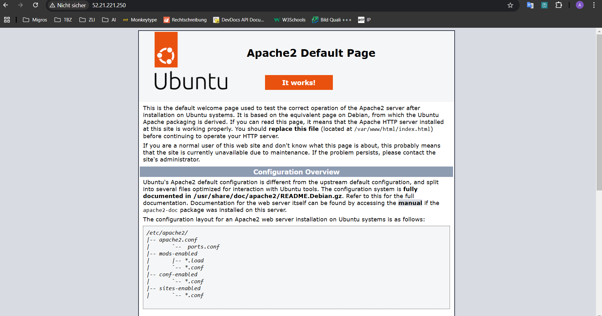
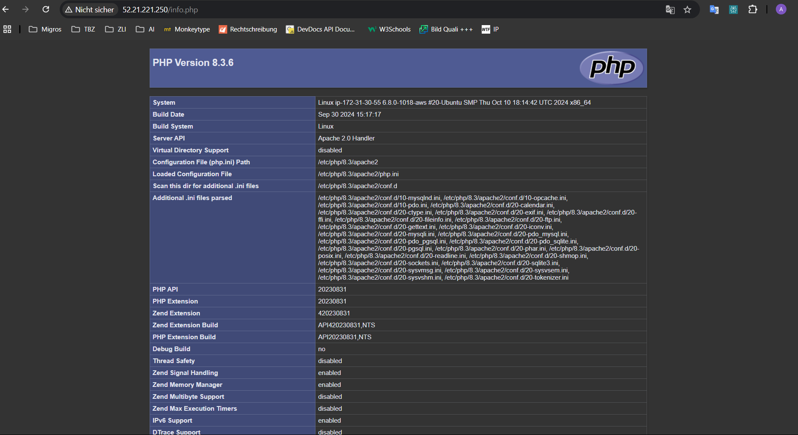
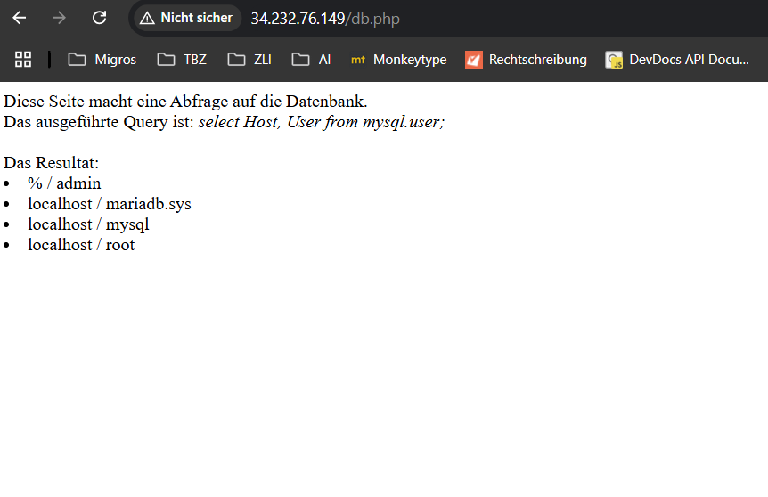

# KN05

## Aufgabe 1

### VPC (Virtual Private Cloud)  
Ein isoliertes virtuelles Netzwerk in der Cloud, in dem Ressourcen wie Server sicher betrieben werden.

### Subnetz  
Ein Teil eines Netzwerks, das zur Organisation und Trennung von Ressourcen gebraucht wird.

### Public IP  
Eine eindeutige IP-Adresse, über die direkt aus dem Internet erreichbar sind.

### Private IP  
Eine IP-Adresse, die nur innerhalb eines privaten Netzwerks verwendet wird und nicht im Internet sichtbar ist.

### Static IP  
Eine dauerhaft zugewiesene IP-Adresse, die sich nicht ändert.

---

### Subnetz-Liste

---

### IPs für Web- und DB-Server/Instanz
DB: 172.31.48.10  
Web: 172.31.48.20

---

## Aufgabe 2

## 1. Sicherheitsgruppe

### Regeln DB

### Regeln Web

### Sicherheitsgruppen

## 2. Öffentliche, statische IP

### Elastic Ip

## 3. Instanzen erstellen

### Liste der Instancen

### Subnetz DB

### Subnetz Web

---

### Seiten Aufrufen

### index.html

### info.php

### db.php
