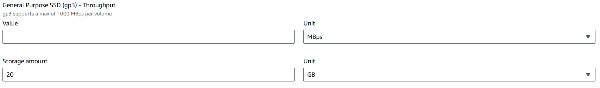
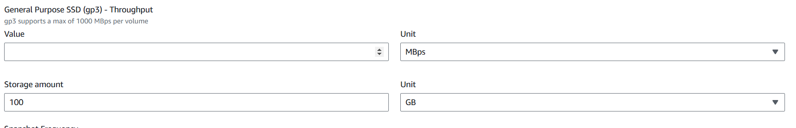
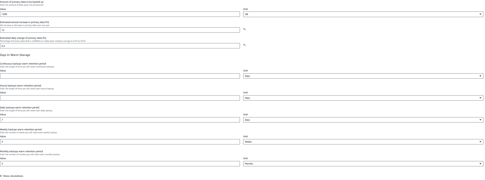
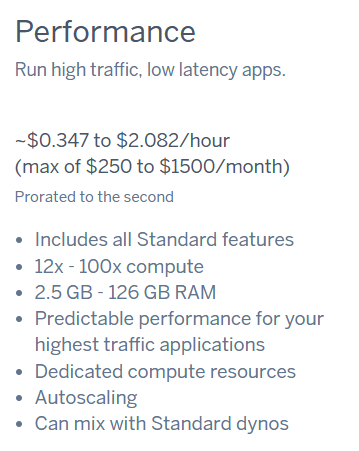
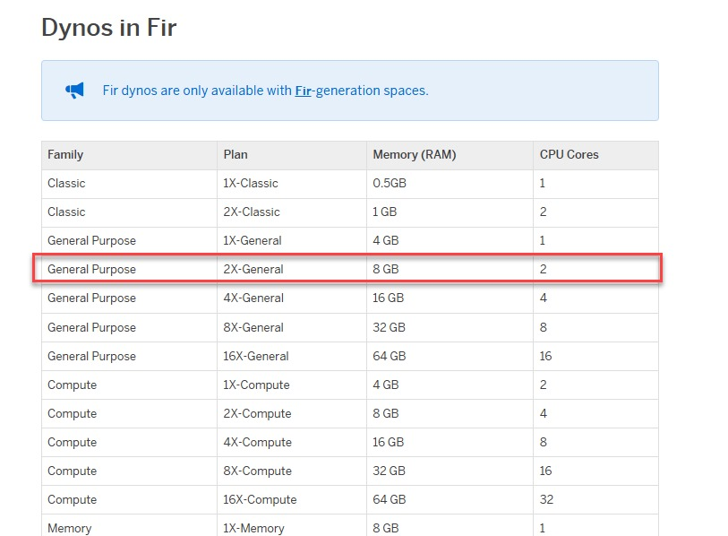
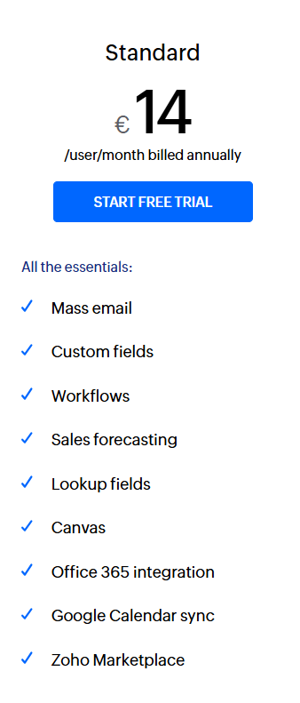
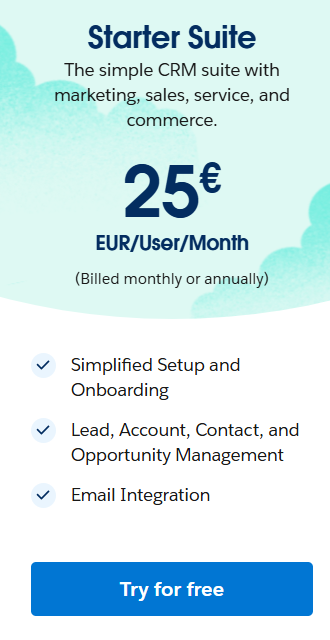

# KN10

## Aufgabe A

### AWS
ASW Details:
[AWS Details](/m346/KN10/AWS_Details.pdf)

Web:

DB:

Backup:

### Erklärung
Wir haben uns bewusst für eine sichere Variante entschieden, um die Stabilität und Zuverlässigkeit der Migration zu gewährleisten. Dabei haben wir darauf geachtet, entweder dieselben Spezifikationen wie in der aktuellen On-Premise-Infrastruktur zu übernehmen oder diese in kritischen Bereichen wie Speicher und Leistung leicht zu erhöhen. Dies minimiert potenzielle Risiken und stellt sicher, dass die Applikation auch in der Cloud reibungslos läuft.
### Azure

[Azure_Details](/m346/KN10/ExportedEstimate.xlsx)

## Aufgabe B
Web Performance

Begründung:
- privat geht nicht, shield wäre overkill, deshalb performance plan
- 2.5GB passt gut

DB Performance

Begründung:
- 2 Cores und genügend Ram

## Aufgabe C

### Zoho CRM

### SalesForce Sales

### Begründung:
- Wir haben es wegen dem preislichen Verhältnisses genommen.
- Die anderen Angebote haben unnötige Features die wir nicht brauchen.

## Aufgabe D

Kosten:

AWS ist die günstigste Lösung, da es nur die Infrastruktur bereitstellt. Azure ist ähnlich, aber leicht teurer. Heroku (PaaS) bietet zusätzlichen Komfort, ist jedoch kostspieliger. Zoho und SalesForce (SaaS) sind am teuersten, da sie Software, Wartung und Updates inkludieren. Zusätzliche Kosten wie Entwickleraufwand und Migration sind bei IaaS und PaaS höher.

Aufwand:

IaaS (AWS/Azure): Höchster Aufwand, da die Firma Infrastruktur und Software selbst verwaltet.
PaaS (Heroku): Weniger Aufwand, Fokus auf die Entwicklung.
SaaS (Zoho/SalesForce): Minimaler Aufwand, alles wird vom Anbieter übernommen.